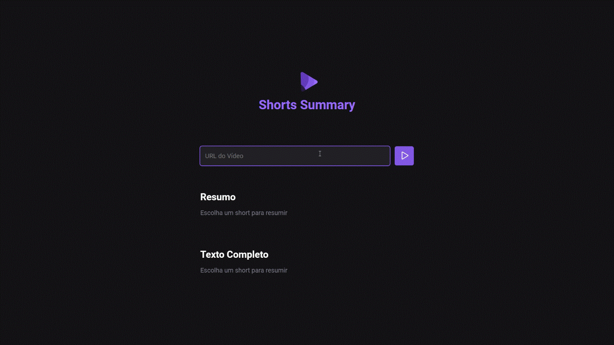
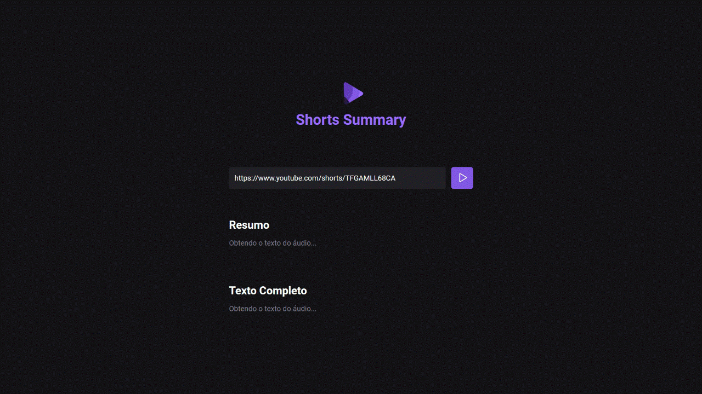
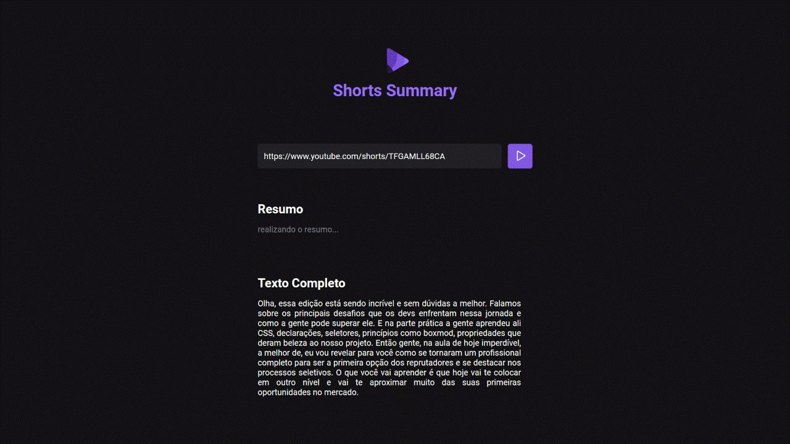

# NLW IA 2023
 
## Sobre o projeto

O Shorts Summary é um projeto da trilha **Foundations** desenvolvido no NLW IA da **Rocketseat**.

Neste foi proposto utilizando os fundamentos básicos de Web e IA uma aplicação que resume o conteúdo de Shorts vídeos do YouTube:
- Por meio do endereço de um Shorts do YouTube, usar uma IA para exibir o texto do áudio do vídeo e o resumo em tela;

### Na Aula 01 foi desenvolvido o Frontend da página:
- Criando o projeto com Vite;
- Construção da estrutura da página em html;
- Estilização com CSS, abordando a seleção por classe, objeto e id;
- Uso da biblioteca phosphor-icons web.

### Na Aula 02 foi desenvolvido o Backend da página:
- Instalando as bibliotecas para lidar com as funcionalidades do backend comunicando com o frontend, e os downloads do vídeo:
- Usamos o **Express** para criar um servidor local e lidar com as solicitações e respostas;
- Para permite a comunicação do servidor com o frontend usamos o **Cors**;
- No frontend usamos o **Axios** para fazer requisições ao backend;
- **Ytdl-core@4.10.0** usamos para comunicar e fazer o download dos vídeos da plataforma do YouTube e a conversão em áudio.

### Na aula 03 integração	do a IA:
- Instalando as bibliotecas para lidar com a manipulação de áudios e a comunicação com a IA;
- Com a **Xenova/transformers** possibilita usar modelos de inteligencia artificial (IA) no projeto;
- Usamos as bibliotecas **fluent-ffmpeg ffmpeg-static** para lidar com os arquivos de áudios extraídos do vídeo; 
- E com o **node-wav** converter o conteúdo do vídeo.


## Layout web desenvolvido







## Tecnologias e bibliotecas utilizadas
- HTML / CSS / JavaScript
- Vite
- phosphor-icons
- express 
- cors 
- axios 
- ytdl-core@4.10.0
- @xenova/transformers 
- fluent-ffmpeg 
- ffmpeg-static 
- node-wav

# Como executar o projeto

Pré-requisitos: NODE e npm

```bash
# clonar repositório
git clone https://github.com/Paulohbarbosa/nlwIA_foundations.git 

# entrar na pasta do projeto raiz e instale as dependências
npm i

# executar o projeto 01 terminal
npm rum web

# executar o projeto 02 terminal
npm rum server
```

# Autor

Paulo Barbosa

https://www.linkedin.com/in/paulo-henrique-barbosa-495492160